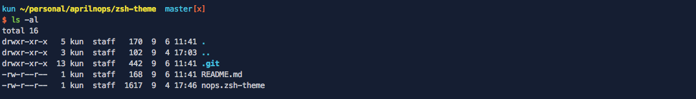

# diy-ys-theme
custom theme of ys:https://github.com/robbyrussell/oh-my-zsh/edit/master/themes/ys.zsh-theme

remove hostname and time which i donn't like

# ScreenShot

# usage

## zsh
Put nops.zsh-theme in your .oh-my-zhs/themes directory, then in your .zshrc file:

ZSH_THEME="nops"

## antigen
antigen theme aprilnops/zsh-theme nops
    

